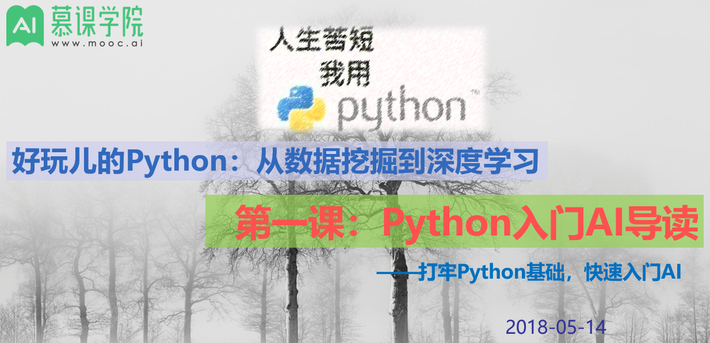

# Python-learning
**好玩儿的Python：从数据挖掘到深度学习**
- 详情请点击：[慕课学院](http://www.mooc.ai/course/489)

## Git代码库
- 克隆代码库到本地:
> git clone git@github.com:wqw547243068/Python-learning.git

## 课程列表
### 时间线

|*时间*|*章节*|*题目*|*作业*|*备注*|
|----|----|:------:|:----|:----|:----|
|2018-5-14|第一节|导读|||
|2018-5-21|第二节|Python基础|请完成ppt里提到的5-6个作业|这节课长达2h，内容非常多|
|2018-5-28|第三节|文本处理||字符串+面向对象+文本处理|
|2018-6-6|第四节|数据分析基础||Python生态圈及数据分析|
|||||||

### 内容提要

#### 第一节 入门导读
内容如下：
1. AI时代何去何从
   - 时代浪潮：移动互联网→O2O→大数据→互金→智能家居→共享→AI→区块链
   - DL是AI/ML的一个重要分支，Data是燃料（DM能力不可或缺）
1. 如何高效学习
   - 知乎：[为什么大多数人宁愿吃生活的苦，也不愿吃学习的苦？](https://www.zhihu.com/question/272483562/answer/376542013)（主动吃苦）
   - 学习金字塔: 主动学习＞被动学习,教授＞总结＞实践＞看书
   - 费曼技巧：[终极快速学习方法](https://www.zhihu.com/question/20576786)
   - 怎么成为大牛？走出舒适区，进入学习区
   - 大脑的学习之道：图谱结构+注意力+联想记忆+推理反思
1. 课程导读

#### 第二节 Python基础
内容如下：
1. 入门神图：
   - 包，程序入口，函数，循环，分支，编码
1. 开发环境：
   - 三大流派：IDE+命令行+web
   - Linux开发环境是互联网标配
   - 大神简介：[Linus，一生只为寻找欢笑](https://zhuanlan.zhihu.com/p/19796979)
   - [入门级：GitHub和Git超超超详细使用教程](https://blog.csdn.net/javaandroid730/article/details/53522872)
   - [Git简易指南](http://www.bootcss.com/p/git-guide/), [Git快速入门](http://www.cnblogs.com/polk6/p/git-introduce.html)，[猴子都能懂的git入门](http://backlogtool.com/git-guide/cn/)，[Git常用命令速查表](https://files.jb51.net/file_images/article/201409/git_big_jb51.jpg)
   - 官方环境[Jupyter Lab](http://jupyter.org/try)、[Google Colab](http://g.co/colab)（含GPU要翻墙）、 [Kaggle](https://www.kaggle.com/kernels)
   - [7个Jupyter Notebook小提示与技巧](https://www.jianshu.com/p/dacc6acba00b), [Jupyter notebook快速入门](https://www.cnblogs.com/nxld/p/6566380.html),[Jupyter nbviewer](http://nbviewer.jupyter.org/)：各种notebook资料分享
1. hello world
   - [如何高效的调试](https://www.zhihu.com/question/21572891), [pdb单步调试技巧](https://www.cnblogs.com/rwxwsblog/p/4605309.html)
   - 代码规范：[Google规范](https://zh-google-styleguide.readthedocs.io/en/latest/google-python-styleguide/python_style_rules/),[Pylint：默认PEP8规范](https://www.ibm.com/developerworks/cn/linux/l-cn-pylint/)
1. 数据结构
   - [数据结构总结](http://lib.csdn.net/article/datastructure/11369)
1. 算法
   - [数据结构算法可视化网站visualgo](https://visualgo.net/en),[图解排序算法](http://www.cnblogs.com/chengxiao/p/6129630.html)
   - [递归，分治算法，动态规划和贪心选择的区别](http://www.cnblogs.com/codeskiller/p/6477181.html)
1. 总结

#### 第三节 Python基础（续）
内容如下：
1. Python之禅：设计哲学
1. 词频统计：词频排序→Top 3→中文版→文件读写→新闻语料
1. 面向对象：代码块→函数→模块（过程） →类→包
   - 面向对象：[初级篇](http://www.cnblogs.com/wupeiqi/p/4493506.html)，[进阶篇](http://www.cnblogs.com/wupeiqi/p/4766801.html)
1. 总结

#### 第四节 Python数据分析基础
1. 数据基础
   - 线性代数（35%）
      - 资料：[「Deep Learning」读书系列分享第二章：线性代数 | 分享总结](https://www.leiphone.com/news/201708/iL1S8jkc4ytZFzHS.html) 【文字版】, [线性代数笔记](https://note.youdao.com/share/?id=2dd5b67042a5a49bd81a450c0a7490be&type=note#/)
   - 概率与信息论（25%）
      - 资料：[「Deep Learning」读书系列分享第三章：概率和信息论 | 分享总结](https://www.leiphone.com/news/201708/lbN7eWYBcovwhhN7.html)，【文字版】
      - 其他资料：[Deep Learning解读合辑 | 国庆特辑](https://mp.weixin.qq.com/s?__biz=MjM5ODU3OTIyOA==&mid=503183187&idx=1&sn=cf18a77ef1249b589c89e23e0ddcae9e&chksm=3ec1ca2009b64336d14cacc57a4dadd6f732af61cf29b6517df7c1387d5eedcd00837dab88e3&mpshare=1&scene=23&srcid=0605oj6B3P1HddCiBJgOolQE#rd), 视频版
1. Python生态圈
   - numpy, 矩阵运算工具，资料如下：
      - [70个NumPy分级练习：用Python一举搞定机器学习矩阵运算](https://www.toutiao.com/a6527910077834199566/?tt_from=mobile_qq&utm_campaign=client_share&timestamp=1525573097&app=news_article&utm_source=mobile_qq&iid=31862217871&utm_medium=toutiao_android)
      - [用python做科学计算——Numpy快速处理数据](http://old.sebug.net/paper/books/scipydoc/numpy_intro.html)
      - [python numpy笔记](https://www.zybuluo.com/chanvee/note/89078)
      - [知识点总结：脑图笔记](https://woaielf.github.io/2017/04/15/numpy/)
   - pandas，表格数据分析工具，资料如下：
      - [Pandas学习笔记|常用功能](https://zhuanlan.zhihu.com/p/25013519)
      - [十分钟搞定pandas](http://www.cnblogs.com/chaosimple/p/4153083.html)
      - [知识点总结：脑图笔记](https://woaielf.github.io/2017/04/22/Pandas/)
   - matplotlib,画图工具，资料如下：
      - [matplotlib官方教程](http://matplotlib.org/1.3.1/users/pyplot_tutorial.html)
      - [matplotlib核心剖析](http://www.cnblogs.com/vamei/archive/2013/01/30/2879700.html)
      - [知识点总结：脑图笔记](https://woaielf.github.io/2017/04/27/matplotlib/)
1. 数据分析
分析流程如下：

   - 朝阳医院数据分析，分析过程参考：[销售数据分析](https://zhuanlan.zhihu.com/p/29210673),[用numpy和pandas分析数据过程](https://zhuanlan.zhihu.com/p/33437294)
   - kaggle数据分析，数据源参考：[各领域公开数据集](https://zhuanlan.zhihu.com/p/25138563)
1. 总结

## 交流分享
欢迎大家入群分享、交流！

